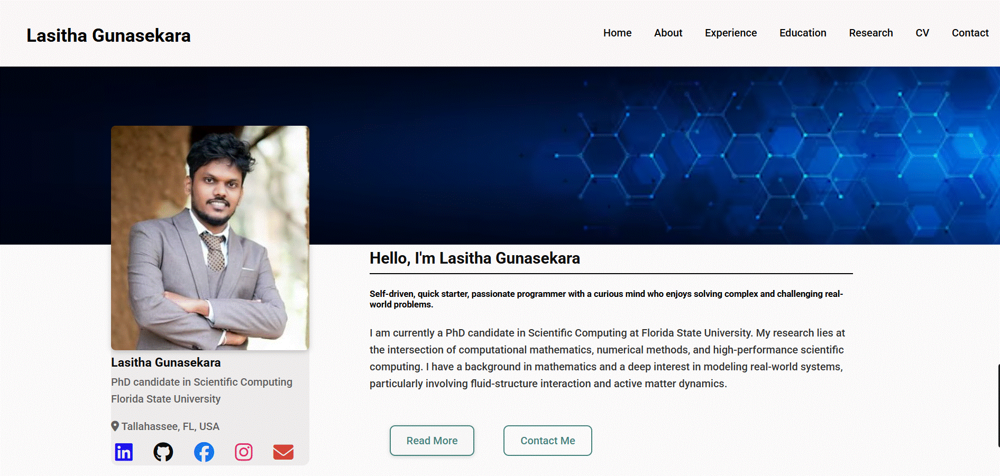

# Lasitha Gunasekara — Personal Portfolio ⚡️

A clean, responsive personal website for **Lasitha Gunasekara**, PhD candidate in **Scientific Computing** at **Florida State University**.

👉 **Live site:** https://lasithagunasekara.github.io


[](./LICENSE)

---

### Preview
<p align="center">
  <kbd>
    <!-- Replace with a real preview GIF/PNG if you add one -->
    
  </kbd>
</p>

⭐️ If you like this site, consider starring the repo!

---

## Features
- ⚡️ Fully responsive (mobile-friendly)
- 🧼 Clean, accessible HTML/CSS/JS
- 🖼 Easy image/content swaps via the `/assets` folder
- 🛠 Simple to deploy with GitHub Pages

---

## Sections
- About  
- Experience  
- Education  
- Research & Projects  
- Skills  
- Contact  
- CV/Resume

---

## Highlighted Projects

- **Project 1 — Near-Singular Integration (Course Project, Spring 2025)**  
  *Team: Lasitha Gunasekara, Sanjida Yeasmin, Jonathan Engle · Advisor: Dr. Bryan Quaife*  
  Survey and analysis of methods for evaluating near-singular integrals (QBX, extrapolated regularization, geometric methods, three-region approaches). Includes theoretical insights and numerical comparisons.

- **Project 2 — Modeling and Analysis of Spin Coating (Advanced Transport Phenomena, Fall 2024)**  
  Derived/validated thin-film equations under lubrication assumptions; reproduced Bornside et al. dry-film thickness results and discussed model limitations.

- **Project 3 — Truncated SVD (tSVD) and Applications (Graduate Seminar, Spring 2024)**  
  Overview of SVD vs. tSVD, dimensionality reduction, noise filtering, and conditioning of linear systems (connections to Chebyshev/Levin-type quadrature).

- **Poster — Capsule in Shear Flow (NJIT Poster)**  
  Role of shear on an **active nematic** viscous drop using spectral BIE methods; step toward simulating suspensions in confinement.

---

## Skills
**Python · C++ · Git · LaTeX · HTML5/CSS3 · Blender · ParaView**

---

## Installation & Deployment

### Run/preview locally
```bash
# clone
git clone https://github.com/LasithaGunasekara/lasithagunasekara.github.io.git
cd lasithagunasekara.github.io

# open index.html in your browser (no build step needed)
